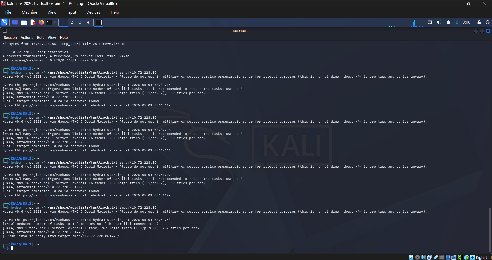
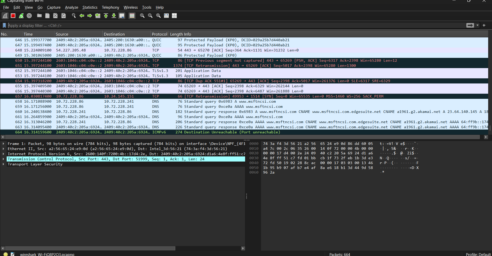
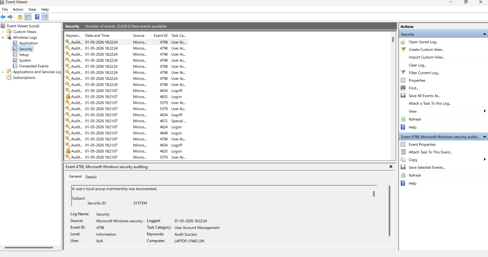
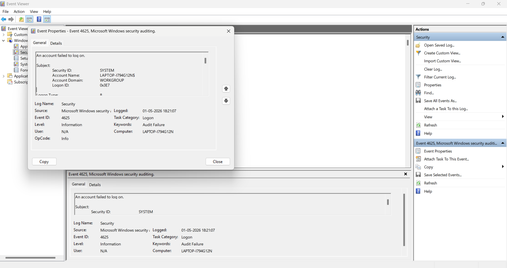

# 🛡️ SSH Brute-Force - Enterprise SOC Home Lab

## 📖 Objective
The objective of this project was to simulate a targeted network-based brute-force attack and track the attacker's footprint using both network monitoring and host-based digital forensics. This lab focuses on executing an attack, identifying visibility gaps, and pivoting to endpoint logs to confirm the indicators of compromise (IOCs).

## 🛠️ Tools & Environment
- *Attacker OS:* Kali Linux
- *Offensive Tools:* Hydra
- *Target OS:* Windows 11 (Endpoint)
- *Network Monitoring:* Wireshark
- *Endpoint Forensics:* Windows Event Viewer
- *Techniques:* Brute Force (T1110), Network Traffic Analysis, Endpoint Detection

## 🚀 Phase 1: Attack Execution (Red Team)
The foundational step involved simulating an adversary attempting to gain unauthorized access via SSH.
- *Execution:* I utilized Hydra on a Kali Linux VM to launch an automated dictionary attack against the OpenSSH service on the Windows 11 target.
- *Result:* Generated over 260 rapid, failed login attempts on port 22.

 
*Ref: Execution of the Hydra password-spraying brute-force attack.*

## 📡 Phase 2: Network Monitoring & The Pivot
To simulate defense, I attempted to capture the authentication traffic flowing between the virtual machines.
- *Observation:* While monitoring with Wireshark, the traffic spike was visible, but the host-level firewall was in "stealth" mode, dropping outbound replies.
- *Action:* This created a visibility gap at the network layer, prompting an immediate pivot to host-based forensics to find the ground truth.

 
*Ref: Wireshark capturing the network traffic with the host firewall stealthing the outbound replies.*

## 🚨 Phase 3: Endpoint Detection & Analysis
Pivoting to the endpoint, I navigated to the Windows Security Logs to uncover the exact footprint of the attack.

### Part 1: Attack Volume Identification
- *Triage:* Successfully isolated a massive cluster of Windows Event ID 4625 (Audit Failure) logs correlating with the exact timeframe of the Hydra attack. The volume of failures confirmed an automated script was in use.

 
*Ref: The initial triage showing the massive volume of Event ID 4625 Audit Failures.*

### Part 2: Forensic Deep Dive
- *Analysis:* Opened the Event Properties of a single 4625 log to uncover the technical details of the breach attempt.
- *Findings:* Identified the attack as Logon Type 8 (NetworkCleartext), definitively confirming a remote, unencrypted authentication attempt. The Source Network Address perfectly matched the Kali Linux attacker IP.

 
*Ref: Deep dive into Event ID 4625 showing the parsed Logon Type 8 and attacker IP.*

## 💡 Key Takeaways
This lab reinforced the importance of layered visibility. It demonstrated the practical necessity of pivoting from Network Analysis (Wireshark) to Endpoint Analysis (Event Viewer) when firewalls obscure traffic, and successfully correlated raw Windows Event IDs with real-world attacker behavior.
